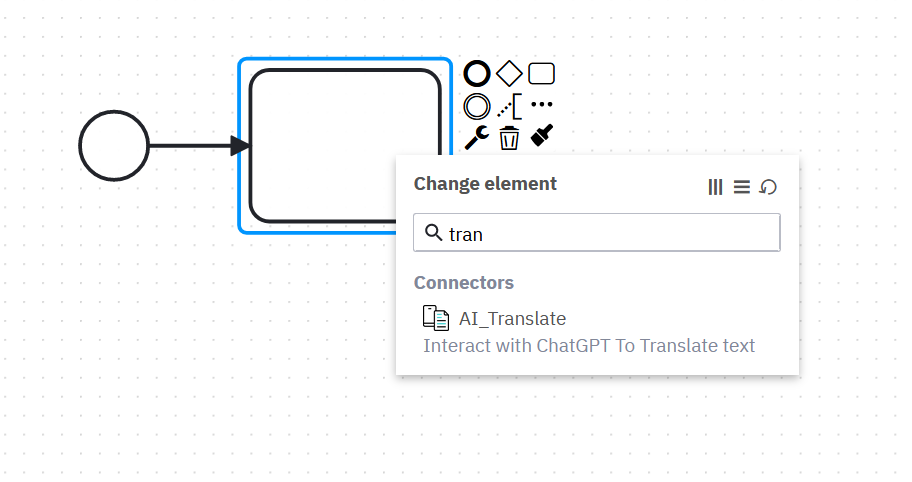

# AI Translate Connector Template

This is a connector template for Camunda 8 SaaS. It uses OpenAI to translate given text into a given language. 

This just uses the [Open AI Connector](https://github.com/camunda/connectors/tree/main/connectors/openai) as a base to build a translation function. 

## Publish the Connector

1. Create a Camunda 8 SaaS account.
2. Upload the `ai_translate.json` file to the Camunda web Modeler
3. Create an OpenAi API key and store it in Camunda as a `secrete` called `OpenAI`
4. Publish the Connector. 

## Using The Connector

To use the Connector start building a model with a service task. 
Use the 🔧 Icon to change the type, then you can do a search for the connector

